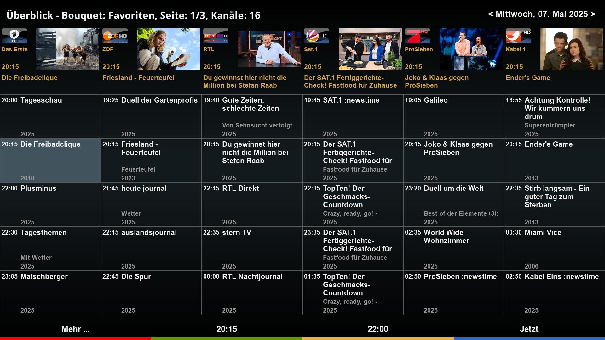
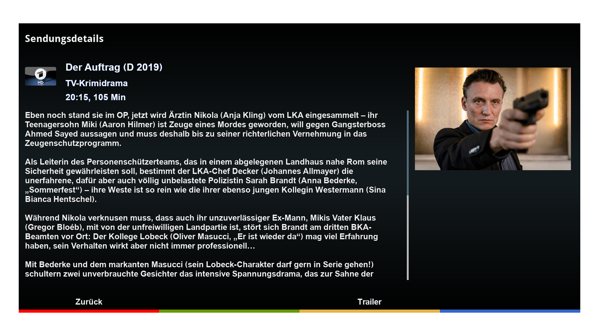

# TVMagazineCockpit (TVC)

Open Enigma2 plugin to browse TV magazine(s)

## Features
- Displays magazine event data for current Enigma2 bouquet
- Integrates zap and add timer functions
- Allows mediathek downloads (if plugin MediathekCockpit is installed)
- Provides additional TMDB event information (if plugin TMDBCockpit is installed)
- Plays back trailer (if available)

## Limitations
- Supports OpenViX and compatible distributions only
- Is being tested on DM9xx only

## Links
- Installation: https://xcentaurix.github.io/TVMagazineCockpit
