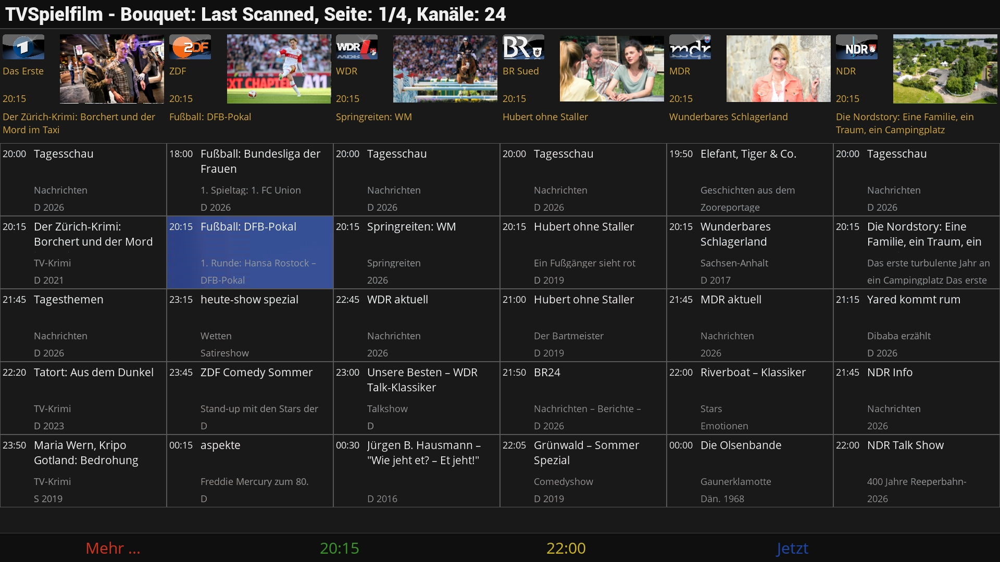

# TVMagazineCockpit (TVC)

Open Enigma2 plugin to browse TV magazine(s)

## Features
- Displays magazine event data for current Enigma2 bouquet
- Integrates zap and add timer functions
- Allows mediathek downloads (if plugin MediathekCockpit is installed)
- Provides additional TMDB event information (if plugin TMDBCockpit is installed)
- Plays back trailer (if available)

## Disclaimer
The project author is not responsible for how this software is used by others. It is not intended to be used for accessing or distributing copyrighted materials without authorization.
Users are solely responsible for determining the legality of their actions.

This repository has no control over the streams, links, or the legality of the content provided by the different hosts (including all mirror sites). It is the end user's responsibility to ensure the legal use of these streams, and we strongly recommend verifying that the content complies with all applicable laws, including copyright laws and regulations of your country's jurisdiction before use.

## Limitations
- Tested on OpenViX and OpenATV with DM900.

## Links
- Installation: https://xcentaurix.github.io/TVMagazineCockpit
